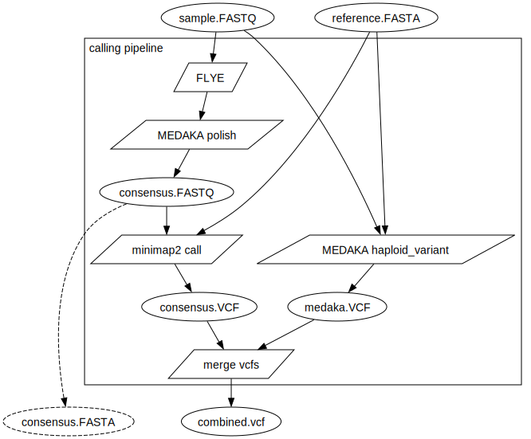

# Comparative analysis of microbial genomes on Oxford nanopore

# Tutorial

Create the `params.json` file describing your task, following the example

```
{
    "sample_files": [
     "wt.fastq.gz",
     "mutant.fastq.gz"
    ],
    "exclude_samples": [],
    "consensus_ref_sample": "wt",
    "data_dir": "data/",
    "medaka_model": "r1041_e82_400bps_sup_v4.2.0",
    "medaka_variant_model": "r1041_e82_400bps_sup_variant_v4.2.0",

    "ref_fa": "data/ref.fasta",
    "ref_gff": "data/ref.gff",
    "ref_id": "REF",
    "gene_annotation_bed": "data/saureus/Saureus8325_gene_annotations.bed"
}
```

Then run the pipeline as

```
nextflow run https://github.com/BioinfoSupport/nanopore_compare.git -params-file params.json -profile local
```

You can use a preconfigured profile for SLURM executor by

```
nextflow run https://github.com/BioinfoSupport/nanopore_compare.git -params-file params.json -profile baobab
```


# Pipeline structure

For each pair of sample (FASTQ, or unaligned BAM/CRAM) and reference
(which is either a supplied reference or a consensus sequence of one
of the designated samples) the overall logic is the following


Then this calling pipeline is applied to each pair of provided sample
and reference, or sample and consensus sequence of a selected
reference sample


## Possible parameters

## Output structure


# TODO list

* Make a simpler/correct annotate consensus vcf by qualities
* Symmetric calling on consensus
  * Potential attempt in medaka_compare project
* Liftover cases (is it needed at all?)
  * Problematic case: SNP coincides with original reference, how to represent this
